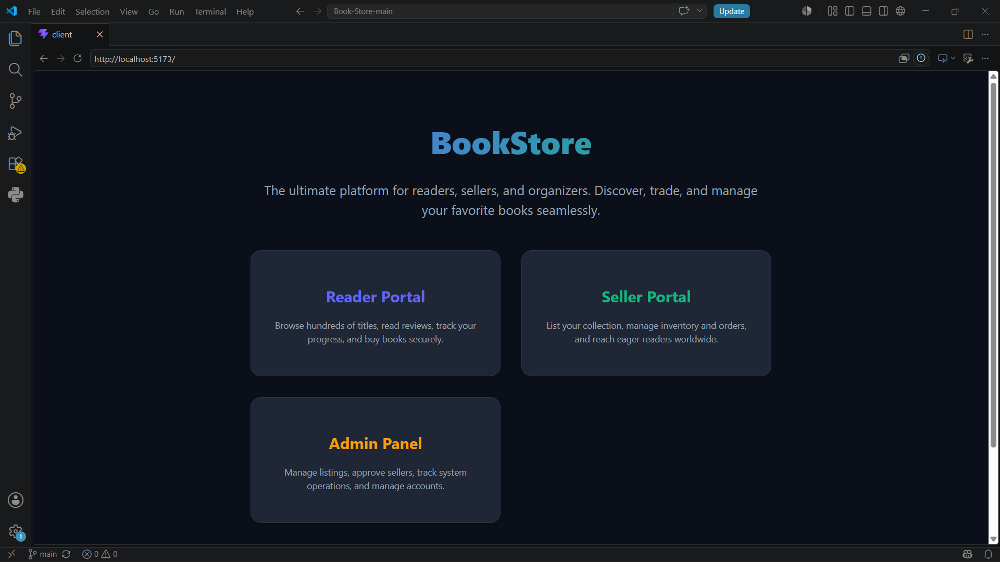
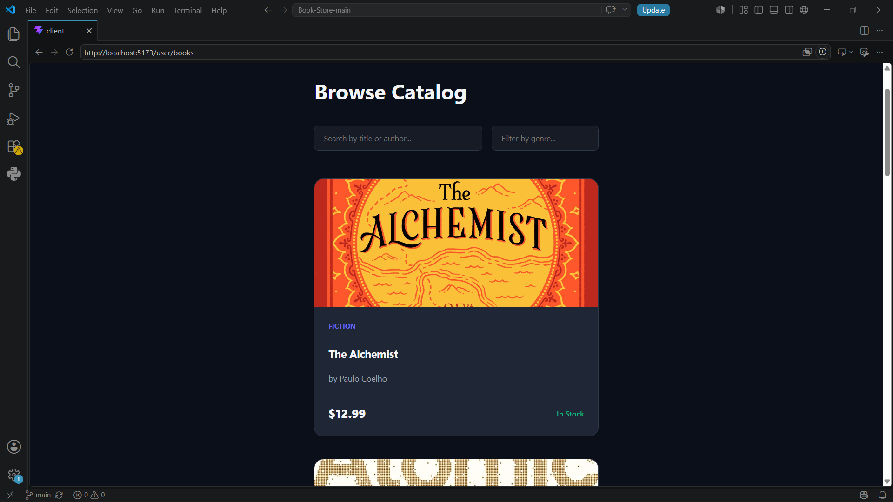
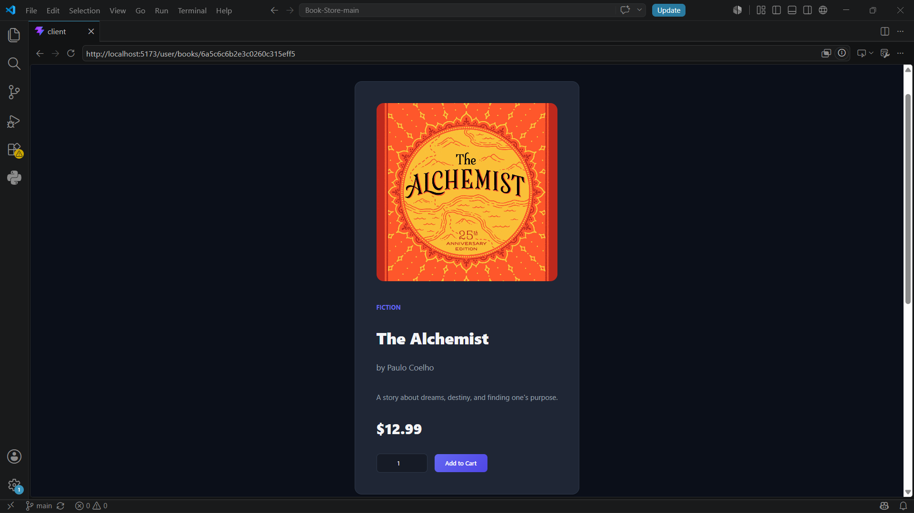
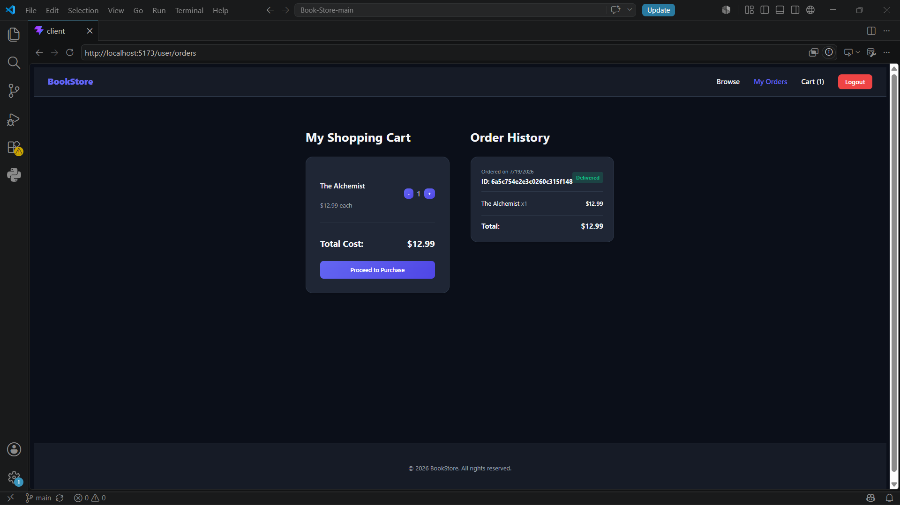
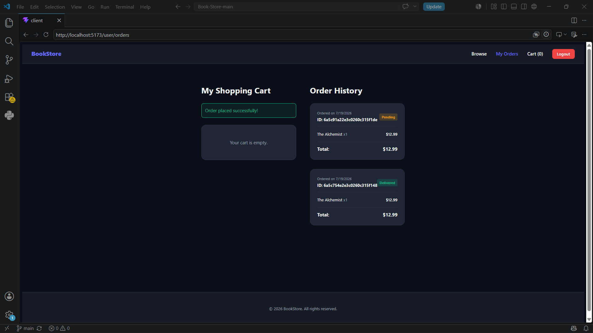
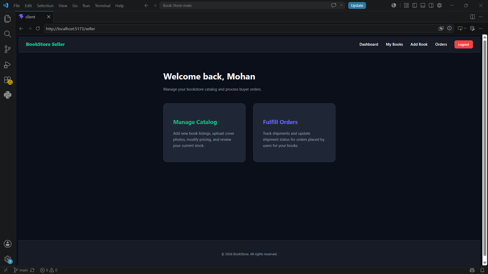
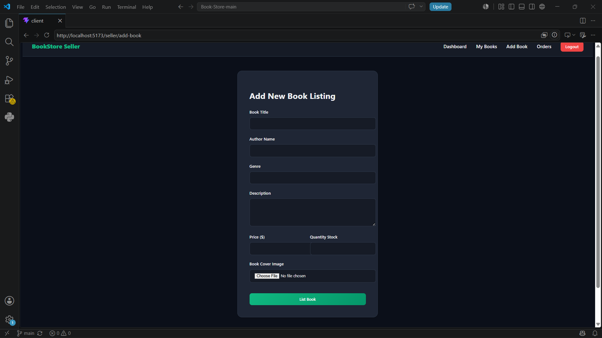
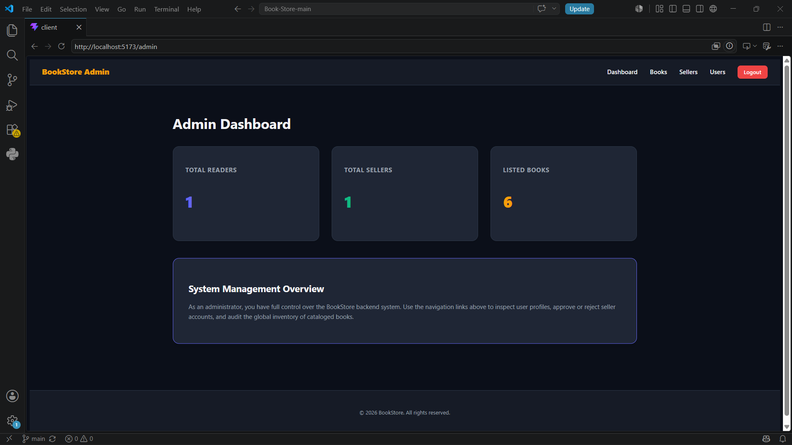

# BookStore - MERN Stack Online Book Shopping System

## Project Overview

BookStore is a full-stack online book shopping web application developed using the MERN Stack:

- MongoDB
- Express.js
- React.js
- Node.js

The application provides a complete online book purchasing experience with separate portals for:

-  Readers
-  Sellers
-  Administrators

Readers can browse books, search products, view book details, add items to their cart, place orders, and track their purchases.

Sellers can upload and manage books with cover images, while administrators can monitor and manage platform activities.

The system implements secure authentication, role-based authorization, responsive UI design, and RESTful APIs.

---

# Features

## Reader Portal

- User registration and login
- Browse available books
- Search books
- View book details
- Add books to cart
- Place orders
- View order history
- Secure authentication

---

## Seller Portal

- Seller registration and login
- Seller dashboard
- Add new books
- Upload book cover images
- Manage uploaded books
- View seller products
- Manage inventory

---

## Admin Portal

- Admin authentication
- Admin dashboard
- Manage users
- Manage sellers
- Monitor application data

---

# Technology Stack

## Frontend

- React.js
- Vite
- JavaScript
- CSS
- Responsive UI Design

## Backend

- Node.js
- Express.js
- REST API

## Database

- MongoDB
- Mongoose

## Security & Additional Tools

- JWT Authentication
- bcrypt Password Encryption
- Multer Image Upload
- CORS
- dotenv
- Git

---

# Project Structure

```
Book-Store-main

│
├── Client
│   ├── src
│   │   ├── Admin
│   │   ├── Seller
│   │   ├── User
│   │   ├── Components
│   │   └── assets
│   ├── package.json
│   └── vite.config.js
│
├── Server
│   ├── config
│   ├── controllers
│   ├── middlewares
│   ├── models
│   ├── routes
│   ├── uploads
│   ├── package.json
│   └── server.js
│
├── screenshots
│
├── Documentation
│
├── README.md
│
└── .gitignore
```

---

# Installation and Setup

## Prerequisites

Install the following software:

- Node.js (v16 or above)
- MongoDB
- Git

---

# Backend Setup

Open terminal:

```bash
cd Server
```

Install dependencies:

```bash
npm install
```

Create a `.env` file inside the Server folder:

```
PORT=8000
MONGO_URI=your_mongodb_connection_string
JWT_SECRET=your_secret_key
```

Start the backend server:

```bash
npm start
```

Backend runs at:

```
http://localhost:8000
```

---

# Frontend Setup

Open another terminal:

```bash
cd Client
```

Install dependencies:

```bash
npm install
```

Start React application:

```bash
npm run dev
```

Frontend runs at:

```
http://localhost:5173
```

---

# Database Design

MongoDB is used as the database.

## Collections

### Users

Stores reader information:

- Name
- Email
- Password
- User details

---

### Sellers

Stores seller information:

- Seller name
- Email
- Password
- Products

---

### Admins

Stores administrator information.

---

### Books

Stores book details:

- Title
- Author
- Price
- Description
- Category
- Cover image

---

### Orders

Stores customer orders:

- User details
- Ordered books
- Order status
- Purchase information

---

### Inventory

Stores seller book inventory.

---

# Security Implementation

The application includes:

- JWT-based authentication
- Role-based access control
- Password hashing using bcrypt
- Protected routes
- Secure API communication
- Environment variable configuration

---

# Application Workflow

## Reader Flow

```
Register/Login
      ↓
Browse Books
      ↓
View Details
      ↓
Add To Cart
      ↓
Place Order
      ↓
Track Orders
```

---

## Seller Flow

```
Seller Login
      ↓
Dashboard
      ↓
Add Books
      ↓
Upload Cover Images
      ↓
Manage Products
```

---

## Admin Flow

```
Admin Login
      ↓
Dashboard
      ↓
Manage Platform Data
```

---

# Application Screenshots

## Home Page



---

## Reader Books



---

## Book Details



---

## Shopping Cart



---

## Orders



---

## Seller Dashboard



---

## Add Book



---

## Admin Dashboard



---

# Future Enhancements

Possible improvements:

- Online payment integration
- Book recommendation system
- Advanced filtering
- Customer reviews and ratings
- Email notifications

---

# Project Information

Project Name:

**BookStore - Online Book Shopping System**

Technology:

**MERN Stack**

Developed as part of the Skill Wallet project submission.

---

# License

This project is developed for educational purposes.